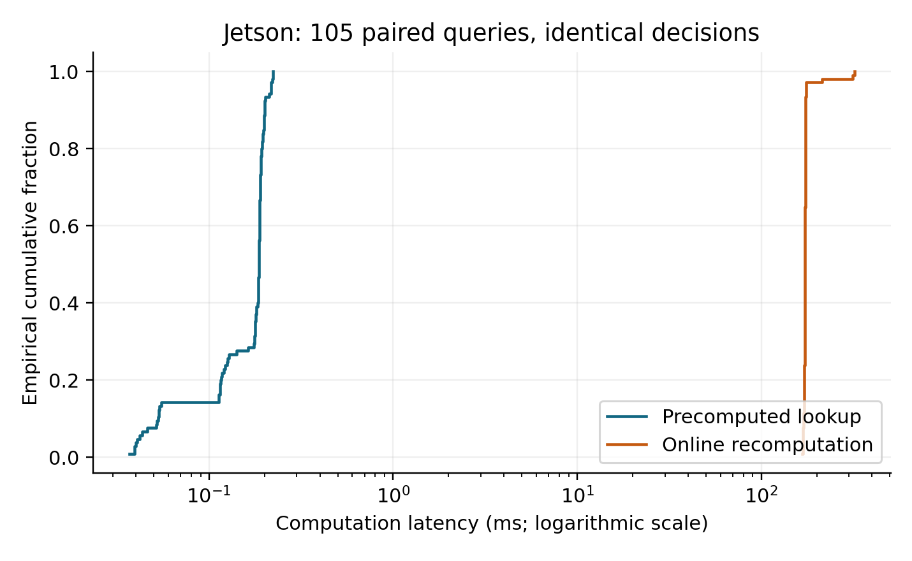
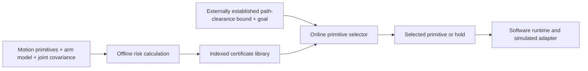

# HRI Risk-Bounded Avoidance

[](LICENSE)
[](pyproject.toml)
[](docs/PAPER_TO_CODE.md)
[](docs/EXPERIMENT_CATALOG.md)
[](docs/PAPER_TO_CODE.md)

Research companion for **Offline-Certified Risk-Bounded Collision Avoidance for Robotic Manipulators Under Encoder Uncertainty** (HRI 2027 manuscript in preparation).

This project studies how an offline library of motion-primitive risk bounds can support fast online motion screening for a planar three-joint arm under encoder uncertainty. It includes the implementation, recorded embedded experiments, reproducibility commands, and software tests.

## What the experiments demonstrate

| Research question | Recorded outcome | Evidence |
| --- | --- | --- |
| Do the historical stress results meet the configured thresholds? | **24/24 pointwise Wilson upper bounds below threshold; directional surrogate coverage 23/24** over 600,000 trials | [Stress records](results/archive/artifacts/stress_validation_results.json) |
| Does the nominal swept check detect between-sample collisions? | **658/658 detected** among 2,500 simulated scenes | [Swept geometry](results/archive/artifacts/swept_validation_results.json) |
| Can lookup preserve the recomputation decision? | **105/105 paired decisions match** | [Paired Jetson records](results/paired_jetson_paper_geometry.jsonl) |
| Does precomputation reduce online computation? | **0.187 ms lookup vs 172.598 ms recomputation**, median on Jetson Nano | [Timing summary](results/paired_jetson_paper_geometry.json) |
| Does the adaptive policy respond to increased modeled uncertainty? | Accepted cases decrease from **114 to 108 to 99 / 120** across covariance multipliers 1, 4, 16 | [Uncertainty replay](results/measured_uncertainty_jetson_paper_geometry.json) |
| Do the tested runtime guards hold? | **360/360 stale-input holds; 360/360 wrong-start holds** | [Replay records](results/measured_uncertainty_jetson_paper_geometry.json) |
| Does measured feedback improve calibration consistency? | Repeat position RMS decreases from **14.628 mm to 4.678 mm** | [Calibration summary](results/feedback_calibration_ablation.json) |

These results support the feasibility of precomputed risk screening under the evaluated model assumptions. The timing comparison uses an uncached implementation of the same expression, not a competing planner; it excludes perception and actuation. Physical closed-loop collision avoidance and safety around moving people remain unvalidated. See [full results and experimental scope](docs/RESULTS.md).



## How it works



The clearance input must conservatively represent the relevant future path. A camera depth value alone does not establish this bound. The replay runtime exercises stale-observation and primitive-start checks; complete deployment guards and physical execution are outside this release.

Hardware: **Hiwonder JetArm-style arm, five positioning joints plus gripper, Jetson Nano 4 GB (user-identified), RGB-D sensing, Ubuntu 18.04.6 and ROS Melodic**. See [robot specifications](docs/HARDWARE.md) for measured configurations and identification limits.

Read the [paper-to-code guide](docs/PAPER_TO_CODE.md) for the distinction between the complete-link model and the historical first-order directional comparison.

## Run and verify

Python 3.10 or newer is required for the portable package.

```bash
python -m venv .venv
# Linux/macOS: source .venv/bin/activate
# Windows PowerShell: .venv\Scripts\Activate.ps1
python -m pip install -e .
python -m unittest discover -s tests -v
python experiments/verify_evidence.py
python -m risk_bounded_collision --output results/example_library.json
```

The tests exercise geometry, risk calculations, motion primitives, storage, swept-clearance margins and runtime guards. The evidence check recomputes paired-decision agreement and median timings from the archived records and checks replay counts; it does not rerun the original hardware experiment.

The generic demo uses legacy 0.30/0.25/0.15 m model links. The paper-aligned experiments below explicitly use **0.4/0.3/0.2 m**, 64 primitives and 40 clearance bins. Neither set is a calibrated physical JetArm model.

## Reproduce the computation experiments

```bash
python -m pip install numpy
python experiments/paired_online_baseline.py --input experiments/stationary_encoder_ticks.json --output results/paired_new_run.json --repeats 5 --link-lengths 0.4 0.3 0.2
python experiments/measured_uncertainty.py --input experiments/stationary_encoder_ticks.json --output results/measured_uncertainty_new_run.json --link-lengths 0.4 0.3 0.2
```

Use fresh output filenames. New timing results describe your machine; they do not reproduce Jetson latency unless run under a comparable Jetson setup. Covariance multipliers 4 and 16 are synthetic sensitivity regimes derived from 30 stationary encoder samples. [Reproduction details](docs/REPRODUCIBILITY.md).

## Repository guide

- [src/risk_bounded_collision](src/risk_bounded_collision): model, geometry, risk library, selector and simulated runtime.
- [experiments](experiments): paired timing and uncertainty-policy experiments.
- [tests](tests): executable checks for the core implementation.
- [results](results): recorded numerical evidence and figures; filenames distinguish paper geometry from legacy and smoke runs.
- [Paper-to-code guide](docs/PAPER_TO_CODE.md): function responsibilities and evidence coverage.
- [Results](docs/RESULTS.md): protocols, quantitative findings and limitations.

The [complete experiment catalog](docs/EXPERIMENT_CATALOG.md) indexes the located numerical results, including all four Monte Carlo suites totaling 1.69 million trials, the 2,500-scene swept check, calibration, embedded timings, and stationary sensing. Browse the [visual gallery](docs/VISUALS.md). The [archive provenance ledger](results/archive/PROVENANCE.json) records source paths and checksums. Raw lab images and depth arrays are not included; full physical acquisition cannot be reproduced from summaries alone. The root `manifest.json` is the historical initial-release snapshot, not the current inventory.

## License and citation

Code is available under the [Apache License 2.0](LICENSE). No accepted-paper status or DOI is claimed. The final bibliographic citation will be added when author and publication metadata are settled.
