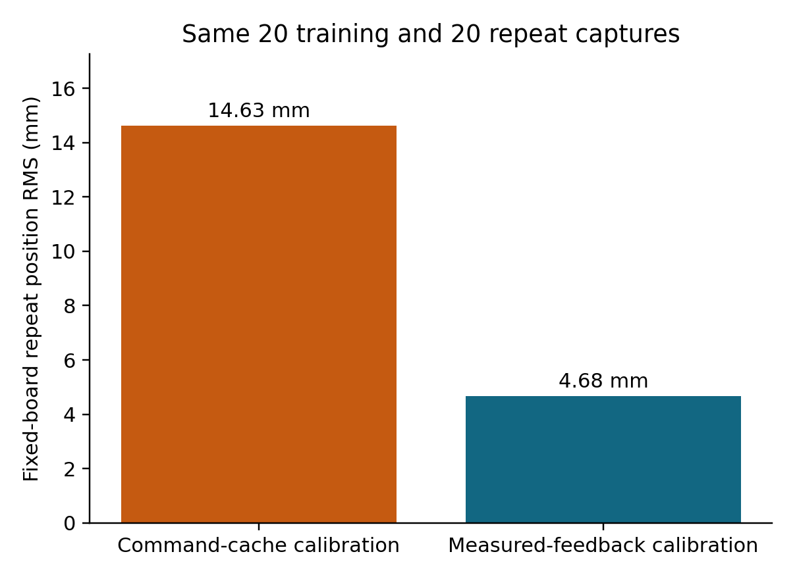
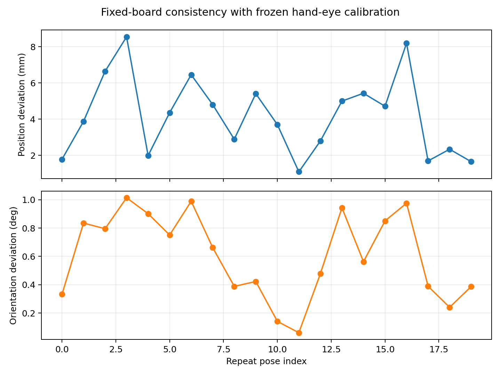
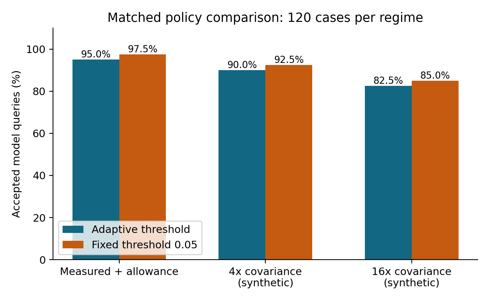
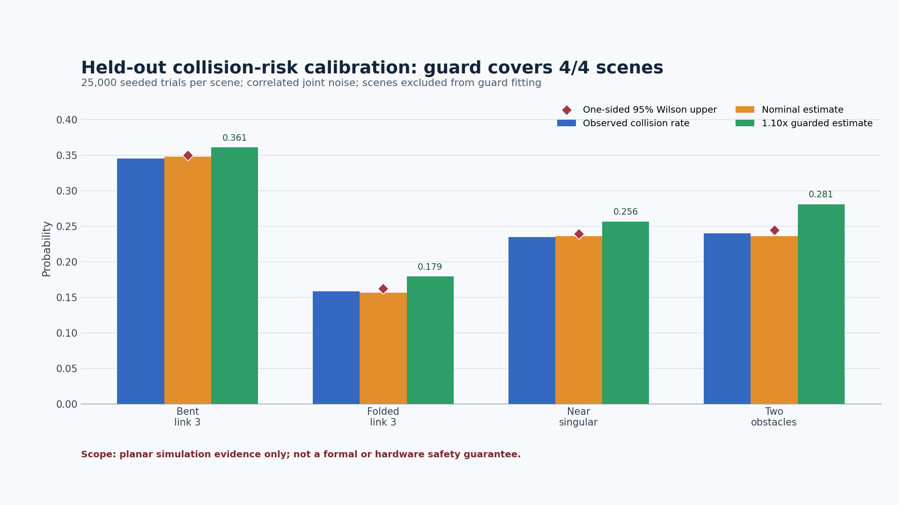
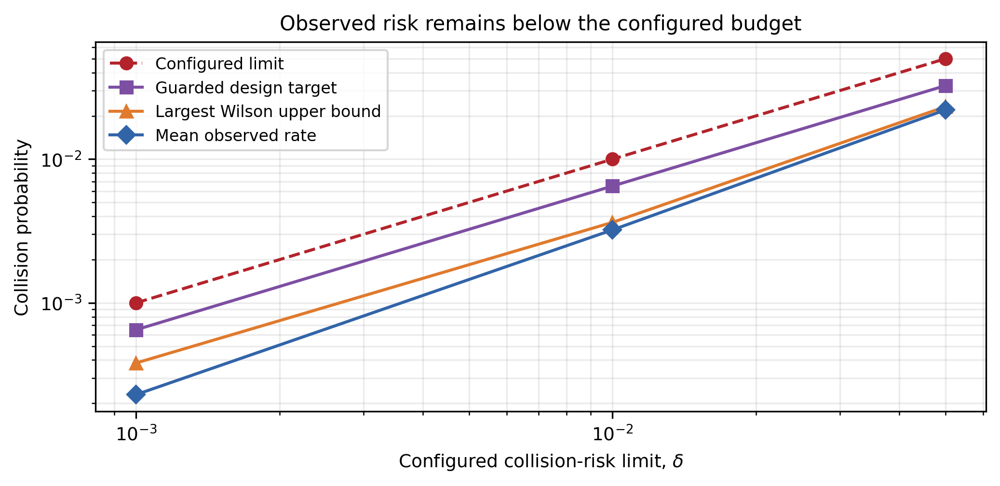
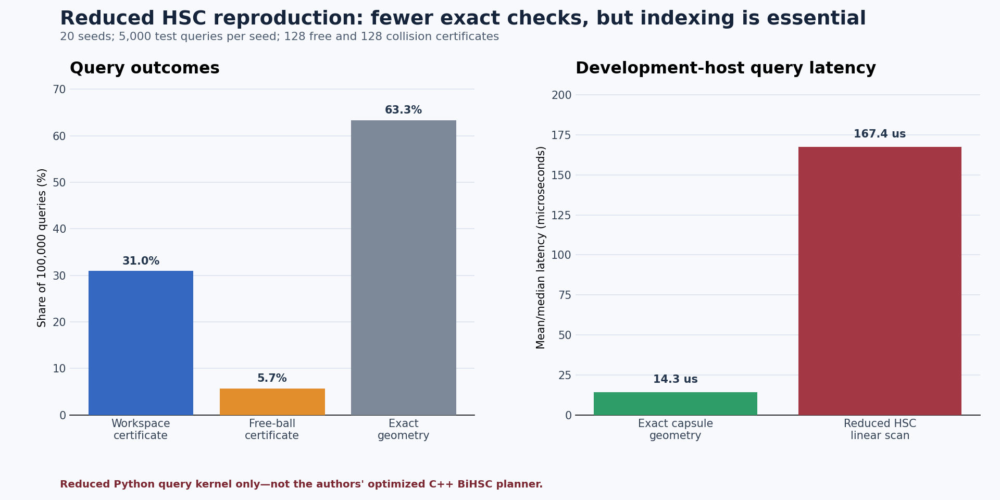

# Research visuals

These are existing experiment figures, not illustrations of physical avoidance.

## Paired embedded computation

[Source records](../results/paired_jetson_paper_geometry.json): median 0.187 ms lookup versus 172.598 ms recomputation, with 105/105 matching decisions. Perception and actuation are outside the timer.

## Calibration consistency

The repeat plot comes from the experiment referenced in **Plan HRI robot experiments**. It shows fixed-board consistency at 20 repeat poses, not independently measured positioning accuracy.

## Policy sensitivity

Covariance factors 4 and 16 are synthetic. Reduced acceptance demonstrates greater restrictiveness, not a physical collision-rate improvement.

## Historical simulation plots

Four held-out scenes, separate from the 24-condition stress matrix. The latter has only 23/24 directional-surrogate coverage.

Nine configuration-level conditions at thresholds 0.001, 0.01 and 0.05; no physical trajectories.

Historical reduced Python baseline. The archived numerical results also retain a false-free classification after rectification; this plot does not establish baseline safety.

Additional original figures retained for provenance:

- [Risk-level margin](../results/figures/historical/risk_level_margin_comparison.png): **known legacy axis-label error**; the rightmost category is printed as 0.1, but the stored experiment uses **0.05**. Use the JSON and risk-budget plot for interpretation.
- [Host runtime profile](../results/figures/historical/runtime_profile.png): development-host 20-bin protocol; the linear-scan entry is the reduced HSC query kernel, a different task. Do not read this as the paired Jetson comparison or a controlled speedup ratio.

The original depth-registration image contains a person in the lab and is excluded from this public gallery. Its numerical records are available in the catalog.
